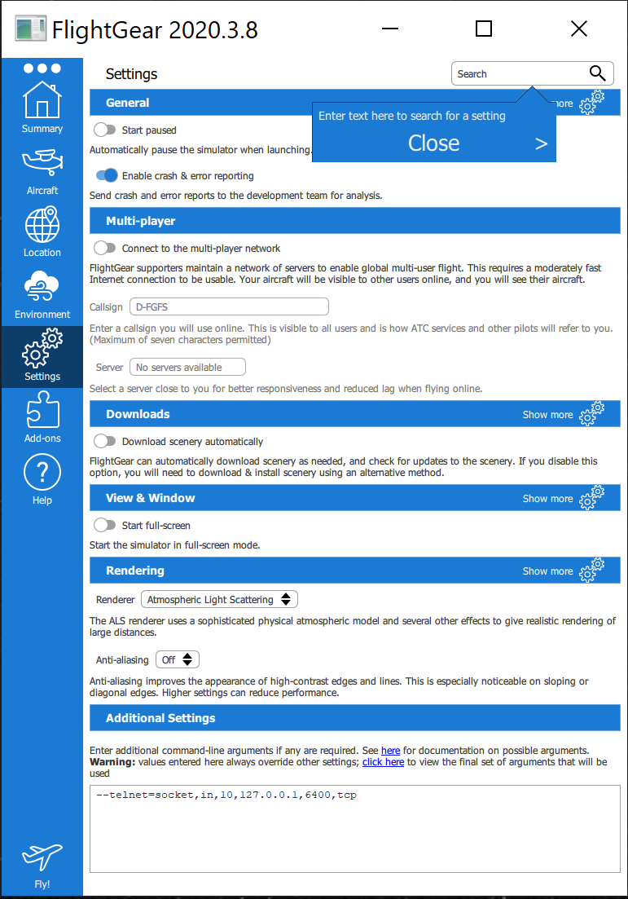
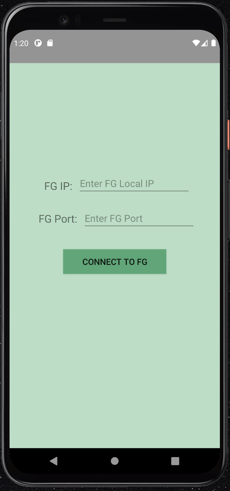

# FlightGear Controller Android-App

In this project, we created an android application that can connect to a FlightGear server and controll the plane.

[A demonstration of the project](https://youtu.be/bFKtNbENRIM)

## Project Structure:
we used the MVVM architecture in order to create the app.
this means we divided the project into three main parts: `View`, `ViewModel` and `Model`.
#### the model:
is responsible for connecting to the FlightGear and send it commands.
#### the ViewModel:
is mainly responsible for linking these two parts,  and in some cases for converting the data from one representation to another.
#### the view:
is responsible for the visual part, and for invoking commands as response to the user actions.
[for more info of the structure look here](Structure.md)

## Download and Set-Up Instruction:
-FlightGear

## Building and running instructions:
##### open the FlightGear:
-open the `FlightGear` now in the Setting->Additional Settings add this line:
`--telnet=socket,in,10,127.0.0.1,6400,tcp`
it should loock like this:

-press 'Fly!' and wait for `FlightGear` to upload.

-now you can press `v` to chnge the view.

-now open the app and in the first activity:

now you need to enter the `ip` 
in the local network - of the device running the `FlightGear`, and the `port` of the 
`FlightGear` and press connect and now you would be pass to the controller activity.

-make sure you start the engine before using the controllers by pressing in the `FlightGear`: Cessna C172P->Autostart
